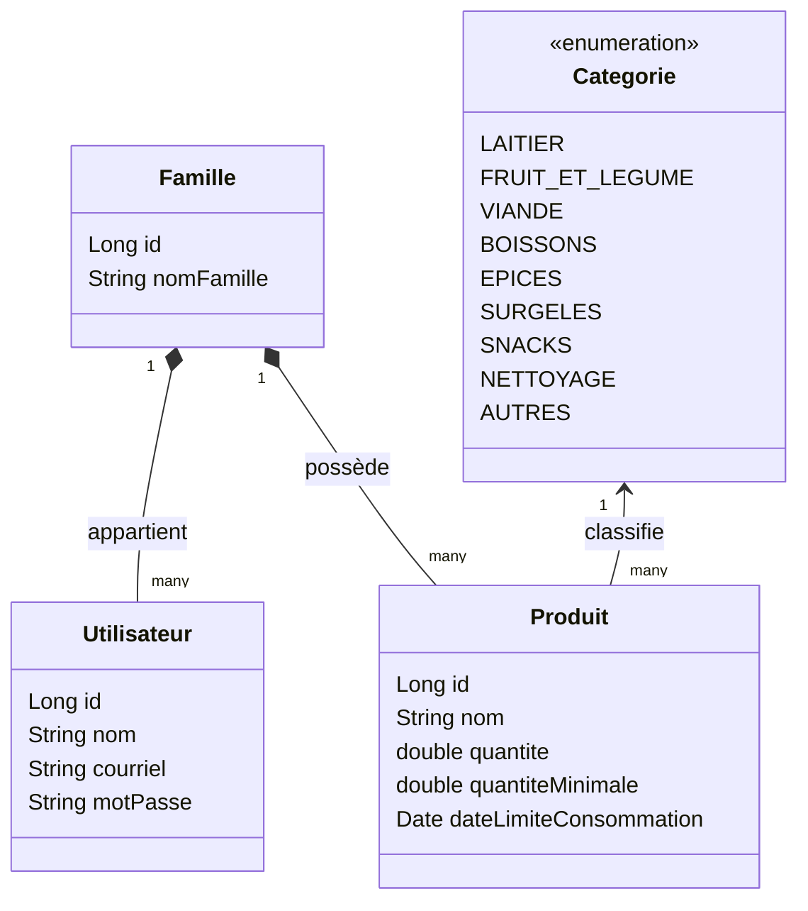

# Projet Web : Inventaire Maison

Une application web conçue pour simplifier la gestion de l'inventaire domestique 
en indiquant précisément les produits en rupture de stock ou en quantité insuffisante.

- **Gestion multi-utilisateur :** L'inventaire est séparé par famille et chaque utilisateur possède son propre profil.
- **Alertes intelligentes :** Système de suivi basé sur des seuils minimaux pour faciliter la liste des courses.

---

## Backend de l'application
Cette partie du projet contient la logique d'affaire et l'API de l'application

### Technologies utilisées
- **Java** (langage principal)
- **Spring Boot** (Framework du backend)
- **PostgreSQL** (Base de données relationnelle)
- **Docker & Docker Compose** (Environnement de base de données local)
- **Maven** (Gestionnaire de dépendances)

## Diagramme de classe de l'application
